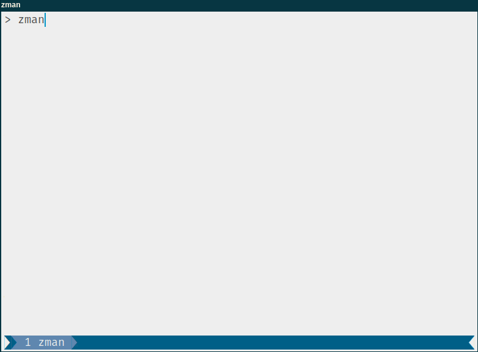
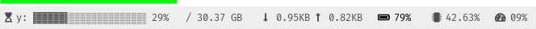

<div align="center">
<h1>zman</h1>

<a href="https://github.com/azzamsa/zman/workflows/ci.yml">

</a>
<a href="https://crates.io/crates/zman">

</a>
<a href=" https://docs.rs/zman/">

</a>
<a href="https://azzamsa.com/support/"></a>
<p></p>



</div>

---

**zman** is a CLI year (time) progress that small, fast, and just one single binary.

## Features

- Show year progress
- Show month, and week progress
- Show result in JSON format
- Cross-platform

## Usage Examples

``` bash
zman                                Show a year progress bar
zman month                          ... a month progress bar
zman week                           ... a week progress bar
zman year --json                    ... a year progress bar with JSON format
```

### Command-line options

``` bash
USAGE:
    zman [FLAGS] [OPTIONS] [time]

ARGS:
    <time>    A time to show [default: year]

FLAGS:
    -h, --help       Prints help information
    -J, --json       Display progress in JSON formatted string
    -V, --version    Prints version information

OPTIONS:
    -f, --full-bar <full_bar>    Set full bar icon [default: ▓]
    -r, --rest-bar <rest_bar>    Set rest bar icon [default: ░]
    -d, --width <width>          Adjust width of the bar (default: 20)
```

### Usage with other tools

You can use Zman with i3status-rust to show salah time in your status bar.



i3status-rust configuration Example:

``` bash
[[block]]
block = "custom"
cycle = ["zman year -J", "zman month -J"]
on_click = "<command>"
interval = 300
json = true
```

See [more examples](examples/) to learn other variations.

If you like `zman` to support your favourite status-bar, please open the issue
with the valid input of your status-bar. In i3status-rust
the valid input it would be `{"icon": "ICON", "state": "STATE", "text": "YOURTEXT"}`.

## Installation

### From binaries

The [release page](https://github.com/azzamsa/zman/releases) includes
pre-compiled binaries for GNU/Linux, macOS and Windows.

### From source

Using Rust's package manager [cargo](https://github.com/rust-lang/cargo):

``` bash
cargo install zman
```

## Development

``` bash
git clone https://github.com/azzamsa/zman
cd zman

# Run unit tests and integration tests
cargo test

# Install
cargo install --path .
```

## Contributing

To learn more read [contributing.md](docs/dev/contributing.md)

## Origin of the name

Zman is 'time' in Arabic, Turkish and Hebrew.

## Inspired By

Please check out this previous work that helped inspire the creation of zman.

- [@year_progress](https://twitter.com/year_progress) - The only progress bar you'd rather see go slower. [source](https://github.com/filiph/progress_bar)

## License

Copyright (c) 2020 Azzamsa

Zman is distributed under the terms of [GPL V3 License](LICENSE).
